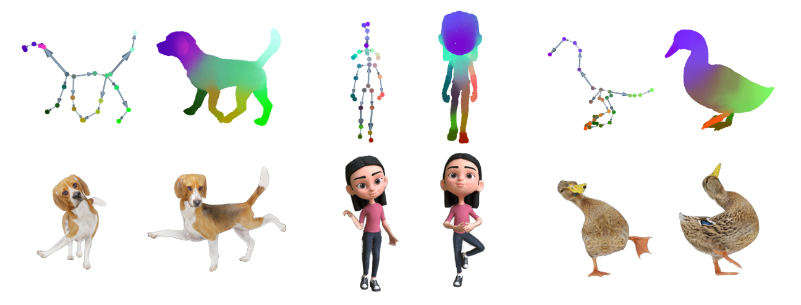

<br />
<p align="center">
    <h1 align="center">
        RigGS: Rigging of 3D Gaussians for Modeling Articulated Objects in Videos
    </h1>

  <p align="center">
  CVPR 2025
    <br />
    <a href="https://yaoyx689.github.io/"><strong>Yuxin Yao</strong></a>
    ·
    <strong>Zhi Deng</strong>
    ·
    <a href="https://sites.google.com/site/junhuihoushomepage/"><strong>Junhui Hou*</strong></a>
  </p>

  <p align="center">
    <a href='https://yaoyx689.github.io/RigGS.html' style='padding-left: 0.5rem;'>
      </a>
  </p>

</p>
<br />

This repository contains the pytorch implementation for the paper [RigGS: Rigging of 3D Gaussians for Modeling Articulated Objects in Videos](https://arxiv.org/abs/2503.16822), CVPR 2025. 



### Install all dependencies  
```shell
git clone https://github.com/yaoyx689/RigGS.git --recursive
cd RigGS 
conda create -n riggs python=3.9 
conda activate riggs

# install pytorch (https://pytorch.org/)
pip install torch==2.0.1 torchvision==0.15.2 torchaudio==2.0.2 --index-url https://download.pytorch.org/whl/cu118


# install pytorch3d (https://github.com/facebookresearch/pytorch3d/blob/main/INSTALL.md)
pip install "git+https://github.com/facebookresearch/pytorch3d.git"


# install gaussian splatting and simple-knn, download from SC-GS(https://github.com/yihua7/SC-GS) 
pip install ./submodules/diff-gaussian-rasterization
pip install ./submodules/simple-knn

# install other dependencies
pip install -r requirements.txt 
```


### Dataset
We used the following datasets in our paper:

- [D-NeRF](https://www.dropbox.com/scl/fi/cdcmkufncwcikk1dzbgb4/data.zip?rlkey=n5m21i84v2b2xk6h7qgiu8nkg&e=2&dl=0)
- [DG-Mesh](https://github.com/Isabella98Liu/DG-Mesh)
- [ZJU-MoCap](https://github.com/zju3dv/neuralbody/blob/master/INSTALL.md#zju-mocap-dataset) 

The pre-processed 2D skeleton and semantic labels and pre-trained checkpoints (`saved_final_results`) can be downloaded [here](https://drive.google.com/file/d/1xkfbqsaXhHEJUrr1LV2ICwyMC5ejNIDY/view?usp=sharing). More details about processing data can be found in [here](./process_data/README.md). 


### Quick start

```
# Rendering with provided check points
python scripts/run_synthesis.py 0 
python scripts/run_zju.py 0 

# Training new data (Find more detailed settings in run_demo.py.)
python scripts/run_demo.py ${data_dir} ${out_dir} 
```


### Citation 
If you find our code or paper helps, please consider citing:
```
@inproceedings{yao2025riggs,
  author    = {Yao, Yuxin and Deng, Zhi and Hou, Junhui},
  title     = {RigGS: Rigging of 3D Gaussians for Modeling Articulated Objects in Videos},
  booktitle   = {The IEEE/CVF Conference on Computer Vision and Pattern Recognition},
  year      = {2025},
}
```

### Acknowledgment
This framework has been adapted from [SC-GS](https://github.com/yihua7/SC-GS), and some of the implementary refer to [RigNet](https://github.com/zhan-xu/RigNet) and [Hi-lassie](https://github.com/google/hi-lassie). Thanks for their excellent work.